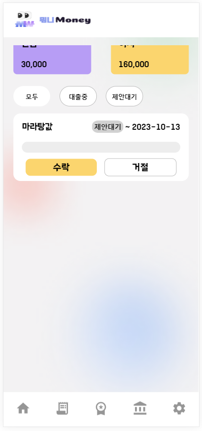
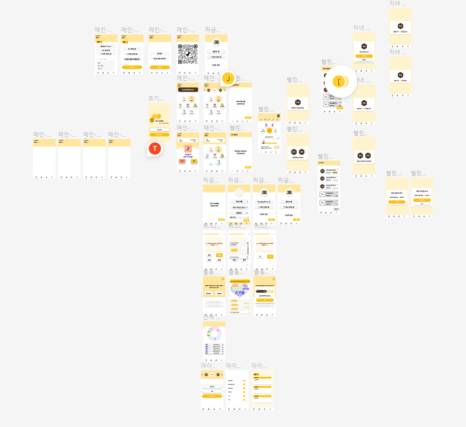

### 목차

| [소개](#소개)                              | [구현](#구현)                                        | [마치며](#마치며)                         |
| :-------------------------------------    | :--------------------------------------------------- | :--------------------------------------- |
| [:book: 개요](#book-개요)                  | [:dart: 주요 페이지 및 기능](#dart-주요-페이지-및-기능) | [:boy: 팀원](#boy-팀원)                    |
| [:bulb: 프로젝트 기획](#bulb-프로젝트-기획) | [:eyes: 산출물](#eyes-산출물)                         | [:mega: 소감](#mega-소감)                  |
| [:cactus: 빌드 환경](#cactus-빌드-환경)    | [:books: 파일 구조도](#books-파일-구조도)              |                                           |
<br/>

# 소개

## :book: 개요

**_👏 SSAFY 9기 2학기 특화 프로젝트 👏_**  
부모와 아이를 위한 금융 교육 어플리케이션을 만들어보자

> 2023.08.21 ~ 2023.10.06 (7주)

<br/>

[🔼 목차로 돌아가기](#목차)

<br/>

## :bulb: 프로젝트 기획

### UCC

[](https://www.youtube.com/watch?v=A62Ahe6Xqdo)

<br/>

### 배경

**"요즘 청소년들의 금융이해력이 매우 떨어진다던데"**

> 10년전보다 점수 더 떨어졌다…청소년 금융이해력 형편없다는데 - 매일경제      
> 청년층 금융이해력, 60대보다 떨어져… 34% "저축보다 소비" - 동아일보  
> 뭐니Money는 짜금통, 챌린지, 금융퀴즈 기능 등을 통해 이를 해결해드립니다.

**"지금 시중에 있는 금융교육 어플리케이션은 아이들이 쓰기엔 너무 어려워"**

> 현재 시중에 출시되어있는 금융교육 플랫폼은 대부분 UI/UX가 아이들이 쓰기엔 복잡합니다.  
> 뭐니Money는 부모가 보는 화면과 아이가 보는 화면을 분리해 이를 해결하였습니다.


<br/>

[🔼 목차로 돌아가기](#목차)

<br/>

## :cactus: 빌드 환경

| FrontEnd                          | BackEnd                                      | Database      | Infra                      |
| :-------------------------------- | :------------------------------------------- | :------------ | :------------------------- |
| react 18.2.0                      | Java 17 (Azul Zulu version 17.0.7)           | MongoDB 3.6.8 | AWS EC2 (Ubuntu 20.04 LTS) |
| recoil 0.7.7                      | Spring Boot 3.0.10                           | Redis 7.2.2   | Nginx 1.18.0               |
| recoil-persist 5.1.0              | Spring Security                              | MariaDB       | GitLab CICD                |
| qrcode.react 3.1.0                | Spring Data JPA                              |               | Jenkins 2.414              |
| react-wordcloud 1.2.7             | QueryDSL                                     |               | Docker 24.0.6              |
| typescript 0.57.1                 | Komoran 3.3.4                                |               | AWS S3                     |
|                                   | Django 4.2.5                                 |               |                            |
</br>
               


<br>

[🔼 목차로 돌아가기](#목차)

<br>

# 구현

## :dart: 주요 페이지 및 기능

### 메인페이지

|               부모 메인페이지                        |                      자녀 메인페이지                                    |
| :-------------------------------------------------: | :-------------------------------------------------:                   |
|          |                              |
|   부모 화면에서는 자녀들의 용돈관리를 할 수 있습니다.   | 자녀 화면에서는 매일매일 <br/>밸런스게임과 금융퀴즈를 통해 용돈을 벌 수 있습니다. |

<br>
<br>

   
### 가족은행 페이지

|                   대출 내역                                 |                                   대출 생성               |                     상세 내용 입력                    | 
| :-------------------------------------------------:        | :-------------------------------------------------------: |  :------------------------------------------------: |
|                          |                       |                    |
|   자녀화면에서는 <br/> 부모에게 빌린 빚을 보여줍니다. | +버튼을 눌러 <br/> 대출을 생성할 수 있습니다.   |  내용 / 기한 / 금액등을 <br/> 적어 대출을 생성합니다. |

|                     자녀 화면                       |                   부모 화면                   |         
| :-------------------------------------------------------: | :-------------------------------------------: | 
|           |   |                          |
| 자녀화면에서는 대출의 수락여부가 보여집니다. | 부모화면에서는 대출을 수락/거절을 할 수 있습니다. | 


|                      대출상환(1)                       |                   대출상환(2)                   |                                   대출상환(3)                                   |
| :-------------------------------------------------------: | :-------------------------------------------: | :---------------------------------------------------------------------------: |
|          |   |                                   |
| 자녀가 대출을 상환하면 <br/>상환된 만큼 진행바가 활성화 됩니다.|


<br>
<br>

### 금용 챗봇


|                                        챗봇 질문                                   |                      챗봇 답변                      |
| :------------------------------------------------------------------------------------: | :------------------------------------------------------: |
|                                             |  |
|  챗봇에게 질문을하면 </br> 답변이 LLM을 통해 생성됩니다. |

<br>
<br>


[🔼 목차로 돌아가기](#목차)

<br/>

## :eyes: 산출물

|               요구사항명세서                |            API 명세서             |
| :-----------------------------------------: | :-------------------------------: |
|  |  |

|              와이어 프레임              |             목업 디자인             |          ERD          |
| :-------------------------------------: | :---------------------------------: | :----------------------------: |
|  |  |  |


### 최종발표 ppt


<br>

[🔼 목차로 돌아가기](#목차)

<br/>

## :books: 파일 구조도

### FrontEnd

```
📦frontend-web
 ┣ 📂public
 ┃ ┣ 📂images
 ┃ ┃ ┣ 📂Modal
 ┃ ┃ ┃ ┗ 📂Quiz
 ┃ ┃ ┣ 📂StartPage
 ┃ ┃ ┗ 📂StartPage1
 ┣ 📂src
 ┃ ┣ 📂apis
 ┃ ┣ 📂assests
 ┃ ┃ ┗ 📂image
 ┃ ┃ ┃ ┣ 📂faq
 ┃ ┃ ┃ ┣ 📂main
 ┃ ┃ ┃ ┣ 📂MoneyPage
 ┃ ┃ ┃ ┣ 📂quiz
 ┃ ┣ 📂components
 ┃ ┃ ┣ 📂Chatting
 ┃ ┃ ┣ 📂Children
 ┃ ┃ ┣ 📂Common
 ┃ ┃ ┃ ┣ 📂About
 ┃ ┃ ┃ ┣ 📂Balance
 ┃ ┃ ┃ ┣ 📂Bank
 ┃ ┃ ┃ ┣ 📂Challenge
 ┃ ┃ ┃ ┣ 📂Faq
 ┃ ┃ ┃ ┣ 📂GoalMoney
 ┃ ┃ ┃ ┣ 📂Main
 ┃ ┃ ┃ ┣ 📂MoneyPage
 ┃ ┃ ┃ ┣ 📂MyPage
 ┃ ┃ ┃ ┣ 📂Quiz
 ┃ ┃ ┣ 📂Layout
 ┃ ┃ ┗ 📂Parents
 ┃ ┣ 📂modal
 ┃ ┃ ┣ 📂Challenge
 ┃ ┃ ┣ 📂GoalMoney
 ┃ ┃ ┣ 📂Loan
 ┃ ┃ ┣ 📂Mypage
 ┃ ┃ ┣ 📂Quiz
 ┃ ┣ 📂pages
 ┃ ┃ ┣ 📂Common
 ┃ ┃ ┃ ┣ 📂StartPage
 ┃ ┃ ┣ 📂Login
 ┃ ┣ 📂states
 ┃ ┣ 📂Styles
```

### BackEnd

```
📦backend
 ┣ 📂src
 ┃ ┣ 📂main
 ┃ ┃ ┣ 📂java
 ┃ ┃ ┃ ┗ 📂com
 ┃ ┃ ┃ ┃ ┗ 📂ntt
 ┃ ┃ ┃ ┃ ┃ ┗ 📂mwonimoney
 ┃ ┃ ┃ ┃ ┃ ┃ ┣ 📂domain
 ┃ ┃ ┃ ┃ ┃ ┃ ┃ ┣ 📂account
 ┃ ┃ ┃ ┃ ┃ ┃ ┃ ┃ ┣ 📂api
 ┃ ┃ ┃ ┃ ┃ ┃ ┃ ┃ ┃ ┣ 📂request
 ┃ ┃ ┃ ┃ ┃ ┃ ┃ ┃ ┃ ┣ 📂response
 ┃ ┃ ┃ ┃ ┃ ┃ ┃ ┃ ┃ ┣ 📂v1
 ┃ ┃ ┃ ┃ ┃ ┃ ┃ ┃ ┃ ┗ 📂v2
 ┃ ┃ ┃ ┃ ┃ ┃ ┃ ┃ ┣ 📂entity
 ┃ ┃ ┃ ┃ ┃ ┃ ┃ ┃ ┣ 📂model
 ┃ ┃ ┃ ┃ ┃ ┃ ┃ ┃ ┃ ┣ 📂dto
 ┃ ┃ ┃ ┃ ┃ ┃ ┃ ┃ ┃ ┗ 📂dtoV2
 ┃ ┃ ┃ ┃ ┃ ┃ ┃ ┃ ┣ 📂repository
 ┃ ┃ ┃ ┃ ┃ ┃ ┃ ┃ ┗ 📂service
 ┃ ┃ ┃ ┃ ┃ ┃ ┃ ┃ ┃ ┣ 📂v1
 ┃ ┃ ┃ ┃ ┃ ┃ ┃ ┃ ┃ ┣ 📂v2
 ┃ ┃ ┃ ┃ ┃ ┃ ┃ ┣ 📂challenge
 ┃ ┃ ┃ ┃ ┃ ┃ ┃ ┃ ┣ 📂api
 ┃ ┃ ┃ ┃ ┃ ┃ ┃ ┃ ┃ ┣ 📂request
 ┃ ┃ ┃ ┃ ┃ ┃ ┃ ┃ ┃ ┣ 📂response
 ┃ ┃ ┃ ┃ ┃ ┃ ┃ ┃ ┣ 📂entity
 ┃ ┃ ┃ ┃ ┃ ┃ ┃ ┃ ┣ 📂model
 ┃ ┃ ┃ ┃ ┃ ┃ ┃ ┃ ┃ ┗ 📂dto
 ┃ ┃ ┃ ┃ ┃ ┃ ┃ ┃ ┣ 📂repository
 ┃ ┃ ┃ ┃ ┃ ┃ ┃ ┃ ┗ 📂service
 ┃ ┃ ┃ ┃ ┃ ┃ ┃ ┣ 📂game
 ┃ ┃ ┃ ┃ ┃ ┃ ┃ ┃ ┣ 📂api
 ┃ ┃ ┃ ┃ ┃ ┃ ┃ ┃ ┃ ┣ 📂request
 ┃ ┃ ┃ ┃ ┃ ┃ ┃ ┃ ┣ 📂entity
 ┃ ┃ ┃ ┃ ┃ ┃ ┃ ┃ ┣ 📂exception
 ┃ ┃ ┃ ┃ ┃ ┃ ┃ ┃ ┣ 📂model
 ┃ ┃ ┃ ┃ ┃ ┃ ┃ ┃ ┃ ┣ 📂dto
 ┃ ┃ ┃ ┃ ┃ ┃ ┃ ┃ ┃ ┗ 📂vo
 ┃ ┃ ┃ ┃ ┃ ┃ ┃ ┃ ┣ 📂repository
 ┃ ┃ ┃ ┃ ┃ ┃ ┃ ┃ ┗ 📂service
 ┃ ┃ ┃ ┃ ┃ ┃ ┃ ┣ 📂member
 ┃ ┃ ┃ ┃ ┃ ┃ ┃ ┃ ┣ 📂api
 ┃ ┃ ┃ ┃ ┃ ┃ ┃ ┃ ┃ ┣ 📂request
 ┃ ┃ ┃ ┃ ┃ ┃ ┃ ┃ ┣ 📂entity
 ┃ ┃ ┃ ┃ ┃ ┃ ┃ ┃ ┣ 📂model
 ┃ ┃ ┃ ┃ ┃ ┃ ┃ ┃ ┃ ┣ 📂dto
 ┃ ┃ ┃ ┃ ┃ ┃ ┃ ┃ ┃ ┗ 📂vo
 ┃ ┃ ┃ ┃ ┃ ┃ ┃ ┃ ┣ 📂repository
 ┃ ┃ ┃ ┃ ┃ ┃ ┃ ┃ ┣ 📂service
 ┃ ┃ ┃ ┃ ┃ ┃ ┃ ┃ ┗ 📂util
 ┃ ┃ ┃ ┃ ┃ ┃ ┃ ┗ 📂quiz
 ┃ ┃ ┃ ┃ ┃ ┃ ┃ ┃ ┣ 📂api
 ┃ ┃ ┃ ┃ ┃ ┃ ┃ ┃ ┃ ┣ 📂request
 ┃ ┃ ┃ ┃ ┃ ┃ ┃ ┃ ┣ 📂entity
 ┃ ┃ ┃ ┃ ┃ ┃ ┃ ┃ ┣ 📂model
 ┃ ┃ ┃ ┃ ┃ ┃ ┃ ┃ ┃ ┗ 📂dto
 ┃ ┃ ┃ ┃ ┃ ┃ ┃ ┃ ┣ 📂repository
 ┃ ┃ ┃ ┃ ┃ ┃ ┃ ┃ ┗ 📂service
 ┃ ┃ ┃ ┃ ┃ ┃ ┣ 📂global
 ┃ ┃ ┃ ┃ ┃ ┃ ┃ ┣ 📂common
 ┃ ┃ ┃ ┃ ┃ ┃ ┃ ┃ ┗ 📂entity
 ┃ ┃ ┃ ┃ ┃ ┃ ┃ ┣ 📂config
 ┃ ┃ ┃ ┃ ┃ ┃ ┃ ┣ 📂exception
 ┃ ┃ ┃ ┃ ┃ ┃ ┃ ┣ 📂fcm
 ┃ ┃ ┃ ┃ ┃ ┃ ┃ ┃ ┣ 📂api
 ┃ ┃ ┃ ┃ ┃ ┃ ┃ ┃ ┃ ┣ 📂request
 ┃ ┃ ┃ ┃ ┃ ┃ ┃ ┃ ┣ 📂model
 ┃ ┃ ┃ ┃ ┃ ┃ ┃ ┃ ┗ 📂service
 ┃ ┃ ┃ ┃ ┃ ┃ ┃ ┣ 📂schedulerservice
 ┃ ┃ ┃ ┃ ┃ ┃ ┃ ┗ 📂security
 ┃ ┃ ┃ ┃ ┃ ┃ ┃ ┃ ┣ 📂jwt
 ┃ ┃ ┃ ┃ ┃ ┃ ┃ ┃ ┃ ┣ 📂exception
 ┃ ┃ ┃ ┃ ┃ ┃ ┃ ┃ ┗ 📂oauth
 ┃ ┃ ┃ ┃ ┃ ┃ ┃ ┃ ┃ ┣ 📂exception
 ┃ ┃ ┃ ┃ ┃ ┃ ┃ ┃ ┃ ┣ 📂handler
 ┃ ┃ ┃ ┃ ┃ ┃ ┃ ┃ ┃ ┣ 📂info
 ┃ ┃ ┃ ┃ ┃ ┃ ┃ ┃ ┃ ┃ ┣ 📂inpl
 ┃ ┃ ┃ ┃ ┃ ┃ ┃ ┃ ┃ ┣ 📂model
 ┃ ┃ ┃ ┃ ┃ ┃ ┃ ┃ ┃ ┃ ┗ 📂vo
 ┃ ┃ ┃ ┃ ┃ ┃ ┃ ┃ ┃ ┣ 📂repository
 ┃ ┃ ┃ ┃ ┃ ┃ ┃ ┃ ┃ ┣ 📂service
 ┃ ┃ ┃ ┃ ┃ ┃ ┃ ┃ ┃ ┗ 📂util
 ┃ ┃ ┗ 📂resources
```

<br/>

[🔼 목차로 돌아가기](#목차)

<br/>

# 마치며

## :boy: 팀원

| [Tech](https://github.com/taekto) | [Rocky](https://github.com/sju3358) | [Light](https://github.com/yunsbob) | [Izzy](https://github.com/izzy80) | [J](https://github.com/freedomDobby) | [Silver](https://github.com/chi980) |
| :------------------------------------: | :----------------------------------: | :------------------------------------: | :----------------------------------------: | :-------------------------------------: | :-------------------------------------: |
|             |           |             |                 |              |              |
|  팀장<br>Front-end<br>Back-end  |         BE Lead          |         Back-end<br>Security          |      Back-end<br>Front-end<br>Design       |      FE Lead<br>Design       |           BackEnd<br>Infra<br>Design           |

### 팀원 역할 상세

### _Tech_
- 로그인 화면 구현
- 밸런스게임 및 퀴즈 화면 구현

### _Rocky_

**BE**
- Spring Boot 와 JPA를 이용하여 Rest API 구현
  - 멤버정보 관련 API
  - 부모-자식 매핑 관련 API
  - 퀴즈 기능 관련 API
  - 밸런스게임 관련 API
  - 짜금통 관련 API
- Spring WebFlux를 이용하여 채팅기능 구현
- Komoran 형태소 분석기를 이용하여 워드클라우드 구현
- S3 구축 및 연동

**FE**
- 채팅 및 워드클라우드 화면 구현

### _Light_

**BE**
- Spring Security를 이용한 멤버권한별 인증/인가 처리
- Spring Security와 Oauth2.0을 이용한 소셜로그인 구현
  - 카카오 로그인 구현
  - 구글 로그인 구현
  - JWT 토큰 발행 및 커스텀 인증필터 구현
- Swagger 구축
- OpenAI API를 활용한 챗봇 구현
- Spring Scheduler를 활용한 정기용돈 API 구현

**FE**
- 챗봇 화면 구현

### _Izzy_

**BE**
- Spring Boot와 JPA를 이용하여 Rest API 구현
  - 챌린지 기능 구현

**FE**
- React를 활용한 부모/자식 챌린지 화면 설계 및 구현

### _J_
- 짜금통 화면 구현
- 부모은행 화면 구현
- 정기용돈 , 특별용돈 화면 구현

### _Silver_
- AWS EC2, Ubuntu, Docker, Jenkins를 활용한 CI/CD구축
- Django를 이용하여 밸런스게임 및 퀴즈 관리자화면 구현
- NH Open API 명세에 따른 금융계좌 생성 및 삭제 API 구현
- 가족계좌 및 짜금통 관련 Rest API 구현

<br/>

[🔼 목차로 돌아가기](#목차)

<br/>

## :mega: 소감

**_Tech(박기택)_**
> 프론트엔드를 맡아 프로젝트를 진행하면서 웹 개발 능력을 향상시킬 수 있는 시간이었습니다.   
> Figma부터 React를 사용하여 화면을 구성하는 과정까지 직접 경험하며 웹 개발의 전반적인 과정을 익힐 수 있었습니다.   
> 또한, 백엔드 팀원들과의 소통을 통해 커뮤니케이션 능력도 향상시킬 수 있었습니다.   
> React를 처음 사용하면서 어려움이 있었지만, 팀원들의 도움으로 성공적으로 마무리할 수 있었습니다.   
> 다들 수고하셨습니다.


**_Rocky(조성락)_**
> JPA를 수강한 거의 모든걸 적용해봐서 기술적 성장을 이룬거 같아 재밌었습니다.  
> 다음번에는 Spring Security에 대해서도 제대로 파고들어 구현해보고싶습니다.

**_Light(윤민재)_**


**_Izzy(이지현)_**
> 백엔드와 프론트엔드 모두에 참여하며 전체 시스템의 동작을 이해하는 경험은 매우 유익했다.   
> 프로젝트에 JPA를 활용하면서 프록시와 관련된 오류를 발견했다.   
> 실제 문제에 직면하며 프록시에 대한 개념을 확실히 배울 수 있어서 좋았다.   
> 저번 프로젝트에서는 CSS 모듈을 사용했지만, 이번에는 styled component를 도입했다.   
> 이를 통해 재사용 가능한 컴포넌트를 어떻게 구현할지에 대해 깊게 고민할 수 있었다.  
> 오류를 발견할 때마다 애를 먹어서 힘들긴 했지만, 그만큼 성장할 수 있어서 의미가 깊다고 생각한다.   


**_J(김재이)_** 
> 프론트개발자로서 사용자 편리성을 다시 한번 고민하게 된 프로젝트 입니다.   
> 아동이라는 사용자를 만족시키기 위하여 주요 기능 컴포넌트를 메인화면에 배치하였습니다.   
> 이러한 과정들을 통하여 기술적 부분 뿐만 아니라 사용자를 생ㄱ가하는 개발자로 성장할 수 있어 좋았습니다.  


**_Silver(최미은)_**
> 어린이를 위한 금융 교육 플랫폼을 개발하며 다양한 경험을 쌓을 수 있어서 좋았습니다.  
> 디자인부터 백엔드 개발, 배포를 하면서 프로젝트의 처음부터 끝까지 참여할 수 있어 전체적인 프로세스를 이해하는데 도움이 되었습니다.  
> 특히 Jenkins를 활용한 CI, CD구축을 통해 지속적인 통합과 배포에 대한 깊이 이해할 수 있었습니다. 


<br/>

[🔼 목차로 돌아가기](#목차)